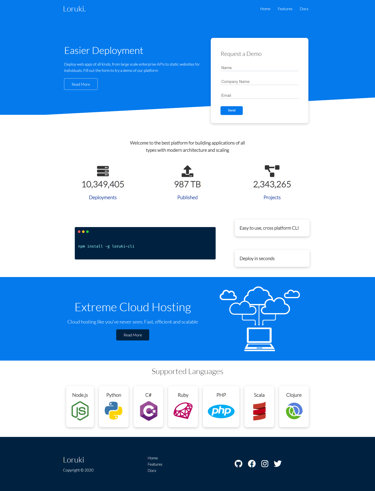
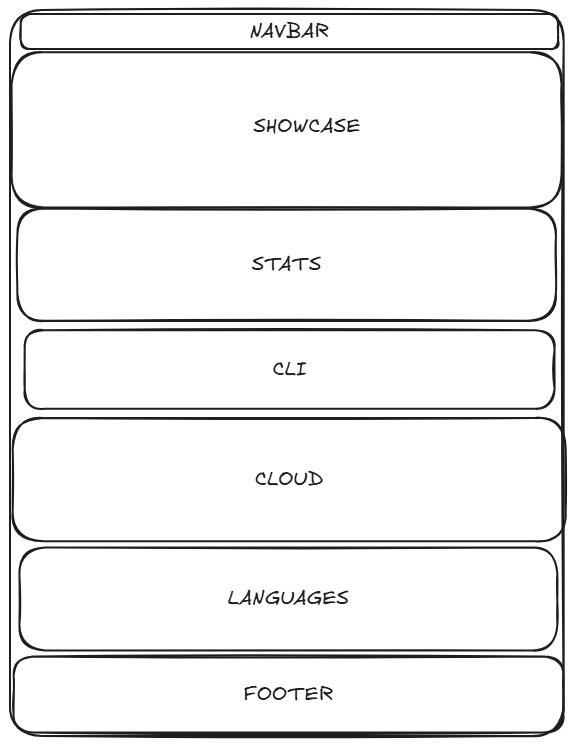

# Design

The Loruki website design aims to provide a clean, user-friendly interface. It
focuses on simplicity and modernity while maintaining a balance between
aesthetics and functionality. The color palette, featuring dark blue as the main
color with vibrant accents for buttons and calls-to-action, gives the site a
professional and elegant look.

The site is designed to be responsive across various devices, using a
well-organized grid layout to ensure a comfortable user experience on both large
and small screens.

## Project's design

---

<!-- give an overview of your project's design -->
<!-- describe the reasoning behind your group's design and wireframe -->
<!-- include other centralized decisions like fonts, palates, ... -->

---

## Wireframe

<!-- provide a link to your wireframe documenting on Figma, or wherever it is -->
